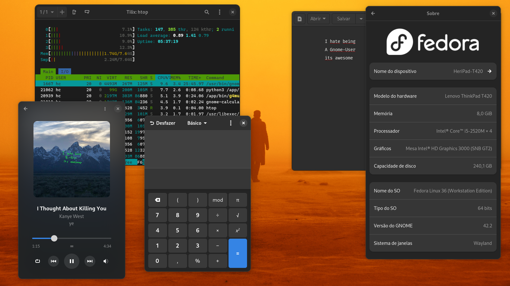
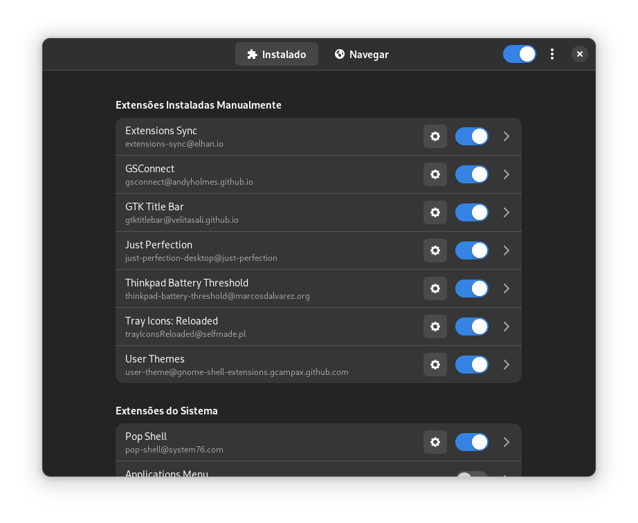
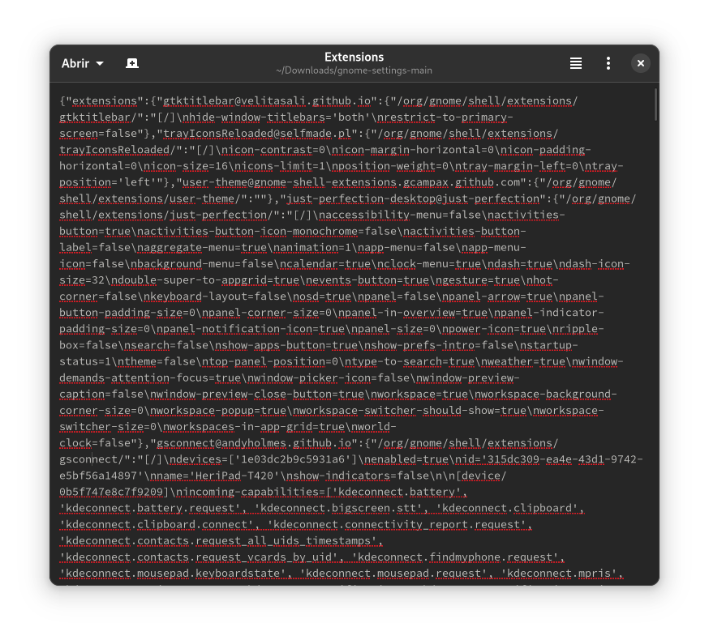

# My Sane Gnome Setup

In this repo i will try to explain my setup and ramble about gnome devs and this DE

# The Idea:

Just a Screen. I don't need much stuff. I don't fiddle around with interfaces, I just need to call the programs and they show up on the screen (?) is that SO hard? so i removed everything. simple as that.

I call all my programs through shortcuts. I use the overview sometimes to switch workspaces or to see the time/date, I think it works pretty great.

## Themes

I just use the normal adwaita theme. To be honest I kinda like the old one more, with all the depth and that kinda-like skeuomorphic design. It was "modern" but not taste-less like GTK4. if it was good i would use elementary OS i guess. More or less the same thing.

I lied. i installed this: <<<https://github.com/lassekongo83/adw-gtk3>>> it makes the gtk3 programs look like gtk4, i mean they are worse but consistent.

## Icons

I tried to use the default ones too. but they are kinda ugly, gnome devs don't want you messing around with themes and icons, but man they are so ugly and inconsistent. And I mean, bro it’s MY computer. I do make the rules so i use the Papirus Icon Theme, they are not that far from the normal ones and are ok and consistent

# Extensions

I've used tiling window managers for a long time and discovered that I'm a simple man, I don't need much stuff, just give me a browser and a terminal and I'm golden.

I don't use many extensions. and the ones that i have functions to dumb-down the desktop. I use the following.

1. [GS connect](https://extensions.gnome.org/extension/1319/gsconnect/)

This one is pretty based. it synchronizes your phone notifications, music, clipboard and other stuff with your computer, thank you KDE project for this.

2. [Extensions Sync](https://extensions.gnome.org/extension/1486/extensions-sync/)

This one synchronizes your keybinds, themes and extensions (duh) in a file or GitHub gist. I'm writing this repo because of it. the file is in this repo if you want my config.

3. [GTK Title Bar](https://extensions.gnome.org/extension/1732/gtk-title-bar/)

This one removes the title bar from programs that don't have a use from then.

4. [Thinkpad Battery threshold](https://extensions.gnome.org/extension/4798/thinkpad-battery-threshold/)

This one is the title. Thanks to the guy that sold me an old-ass battery for 150(BRL) to me, I hate you.

5. [Tray icons: Reloaded](https://extensions.gnome.org/extension/2890/tray-icons-reloaded/)

This one makes gnome developers go CRAZY, they are so entitled and think they are so intelligent that they don't realize that NO ONE CARES about them. why they thought they could get away with removing the tray icons ????? and they say “bro c'mon bro we have apis we have replacements that work integrated with gnome” do they even realize that MAYBE I NEED A NON-GNOME PROGRAM??? This is not apple man. Sometimes I need some obscure crazy thing written for a normal sane desktop environment. It should work with that.

6. [User themes](https://extensions.gnome.org/extension/19/user-themes/)

I don't know why I have this installed. I don't even use it.

7. [Pop Shell](https://github.com/pop-os/shell)

Kinda buggy. but i miss tilling. sometimes i use it

# The Final Say

I am happy with my setup. I Hate gnome so much you have no idea, but I guess I got used to it? I like the overview and a bit of the design. I tried KDE for about 20 minutes and gave up. Maybe someday I will be happy with a riced i3 setup again but i don't want to configure it.

